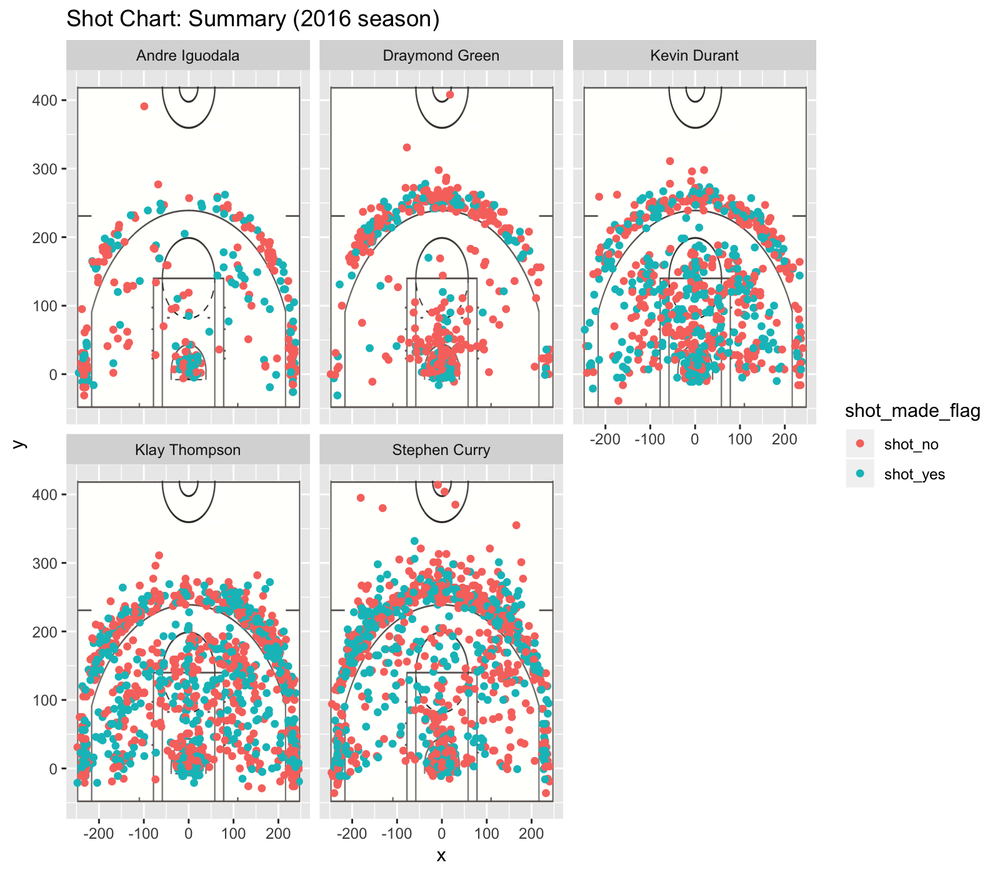

```{r setup, include=FALSE}
knitr::opts_chunk$set(echo = TRUE)
```

```{r, include=FALSE}
coltypes = c("character", "character", "integer","integer","integer","integer","character","factor","factor","integer","character","integer","integer", "character","integer")
df <- read.csv("../data/shots-data.csv", stringsAsFactors = FALSE, header=TRUE, colClasses = coltypes)
```

```{r, include=FALSE}
library(dplyr)
library(ggplot2)
two_pt = filter(df, shot_type=="2PT Field Goal")
three_pt = filter(df, shot_type=="3PT Field Goal")
```

```{r, include=FALSE}
t1 = table(df[,c("name","shot_made_flag")])
t2 = table(two_pt[,c("name","shot_made_flag")])
t3 = table(three_pt[,c("name","shot_made_flag")])
```

```{r, include=FALSE}
#total
t1 = as.data.frame.matrix(t1)
t1$name = row.names(t1)
t1$total = t1$shot_no + t1$shot_yes
t1$made = t1$shot_yes
t1$perc_made = t1$made / t1$total
t1 = t1[,c(3,4,5,6)]
t1=arrange(t1, desc(perc_made))
#2pt
t2 = as.data.frame.matrix(t2)
t2$name = row.names(t2)
t2$total = t2$shot_no + t2$shot_yes
t2$made = t2$shot_yes
t2$perc_made = t2$made / t2$total
t2 = t2[,c(3,4,5,6)]
t2=arrange(t2, desc(perc_made))
#3pt
t3 = as.data.frame.matrix(t3)
t3$name = row.names(t3)
t3$total = t3$shot_no + t3$shot_yes
t3$made = t3$shot_yes
t3$perc_made = t3$made / t3$total
t3 = t3[,c(3,4,5,6)]
t3=arrange(t3, desc(perc_made))
```

###Who is the star player of Golden State Warriors for 2016?

Passes and shoots, a basketball game consists of so many thrilling moments and it appears impossible to quantify these moments, but one question hangs at the back of people's mind all the time and only quantification could answer this question: Who had the best performance?

###Motivation
The outcome of sports games has always been the topic of interests and it even has economic implications. Not only people who gamble on sports but also the general public has expressed their passion for predicting the outcome of sports games. During the last World Cup, an octopus became famous overnight because of its predictions on game outcomes. However, are there better ways to predict the outcome of a sports game than letting an octopus point its tentacles? I believe so and one of the motivations of this paper is to show that a systematic methodology which relies heavily on the power of data science could prove to predict more reliably than random speculation. Another purpose of this paper is to show that the statistics of basketball players could be analyzed visually and to demonstrate that visual representations could be powerful and direct in representing players attributes.

###Background
Basketball is a very popular game all over the world and NBA data is readily available online. Therefore, this paper conducts its data analysis on NBA players in Golden State Warriors. Meanwhile, I hope the same methodology could be applied elsewhere in a different sports field. I focus on year 2016 to study the performance of Andre Iguodala, Draymond Green, Kevin Durant, Klay Thompson, Stephen Curry.

###Data
This analysis is conducted based on the original five csv files I have obtained online on five different players of the Golden State Warriors team in year 2016. The data includes different aspects of their performance in year 2016. Each entry of the file corresponds to a shot made by one of the players. Information include the type of the shot made, whether it is successful, the player who made the shot, how many points did the shot bring and various other information. 

###Analysis
Since the data is about each shot, but however we want to understand the players in order to understand each game. This is because in basketball games, most of the things such as the court size and the size of basketball stay constant, and the only variation is the hands who play them. Understanding who the best player is and the strength of each player could yield crucial significance in understanding the outcome of a basketball game. This is also important when the coach or the manager of team tries to strategize. Data will reveal each players' strong suite and their favorite type of shot. I visualized the performance of five players in a basketball court setting and we could obtain some direct information from these plots instantaneously.

```{r out.width="80%", echo=FALSE, fig.align="center"}

```
In the above graph, the green dots represent shots that are made successfully and the red dots represent shots that failed. We could see that Andre Iguodala and Draymond Green did not make as much shots as compared to the other players. This potentially means that they are not as skilled or they are just strategized not to make many shots. Another obvious conclusion is that Draymond Green had much more reds than greens, which could mean that he is over-confident with his skills. In terms of Kevin Durant, Klay Thompson and Stephen Curry, it is hard to tell from these graphs who the best player is. Each one of them has many green and red dots. 


This suggests that although visualization provides general ideas on the performance of each players but we need more detailed data to provide reliable conclusions on players strength. This is the reason I organized the entries of shot and grouped them into statistics on each players. Below is a snippet example of the code I used to create tables on player shots successs statistics.

```{r, eval=FALSE}
#total
t1 = as.data.frame.matrix(t1)
t1$name = row.names(t1)
t1$total = t1$shot_no + t1$shot_yes
t1$made = t1$shot_yes
t1$perc_made = t1$made / t1$total
t1 = t1[,c(3,4,5,6)]
t1=arrange(t1, desc(perc_made))
```

The data I obtained through this method is showcased below:

```{r, echo=FALSE}
t1
```

As we could see, Kevin Durant had the highest percentage in terms of success of shots. However, Andre is very close in the second place. This overrules my first speculation that Andre might not be as skilled. Although he made less shots, he had a much higher success rate in comparison to the other players. From this table, we would think that Kevin Durant had the best performance as he made many shots and also had a high success rate.

However, we want to further understand this data and I differentiated 2 points from 3 points and repeated the above process. I want to understand the strength of different players.

This is the table on 2 pointers shot by the five players and their success rate:
```{r, echo=FALSE}
t2
```
This is the table on 3 pointers shot by the five players and their success rate:
```{r, echo=FALSE}
t3
```
From these two tables, we could conclude that Andre is the best at making 2 pointers and therefore he should try making more 2 pointers in the near future. His position should be closer towards the center is his coach considers this information. While on the other hand Klay Thompson is the best at making long-ranged shots and he should definitely use that to his advantage. Noteably, Kevin Durant is in the top 3 for both charts, which is why he is the overall top. He is talented and balanced, and is the best player we are looking for.


###Interesting finding
As we could see from the faceted shot chart above, there is a white less dense area between the 3 point shots and the 2 point shots. This could mean that generally when players are near the 3 point line, they chose to go a bit further and turn a 2 point shot into a 3 point shot. They are trained not to make shots close to the inside of that line as a reward of two points does not justify the risks associated with the long distance from center.

###Conclusion
Key takeaway here is that looking at player data from different angles sometimes could yield very different results. For example, when we only observed from the shot charts, I made the wrong assumption that Andre is not as skilled. However, later data analysis shows that he is talented for 2 pointers and he had really high success rate despite him making less shots. Therefore, we could say that Kevin Durant is only the best player here if we consider the data analysis I have performed. However, it is always possbile for future data to come in and change our conclusion. Data is as close as we could get from an accurate prediction of the future. However, we should always keep in mind that how we select and understand our data could shift our conclusions easily. This is the key take away of this analysis.

